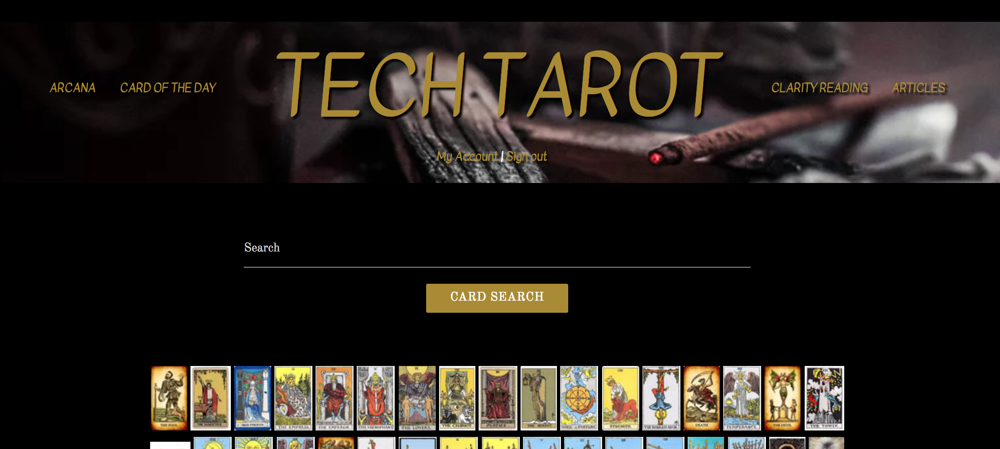

# TECH TAROT
## Epicodus Capstone

#### _By Kaila Goff_   

#### _My capstone website built with Ruby on Rails. 5-11-18_

<!-- <kbd></kbd> -->

## Description
_Tech Tarot is my capstone project for Epicodus. It was built with Ruby on Rails. I used  Materialize Bootstrap and Sass to help style the website. The Ruby gem Devise was used for authentication on the site, and Paperclip was used for image upload. ActiveRecord was utilized in order to store information to a pSQL relational database._

_The website is divided into several different sections. There is a home page that displays all the cards in the deck. There is A major and minor arcana section that shows the cards that are within that arcana._

### Site will potentially also include:

  * - [ ] Page that explains how to read and interpret the cards
  * - [ ] Page that gives a random card reading
  * - [ ] Animations
  * - [ ] Hand drawn versions of all the cards


## Install the DATABASE instructions

* _Enter into the terminal:_ ``` $bundle install```
* _In the following line enter:_ ```$rake db:create```
* _In the following line enter:_ ```$rake db:migrate```
* _In the following line enter:_ ```$rake db:test:prepare```

## Setup/Installation Requirements

  * _Enter in the terminal:_ ``` $rails server```
  * _Using a web browser, type in the url_ ``` localhost:3000 ```

## Known Bugs

  * _No known bugs at this time._

## Support and contact details

  _To suggest changes, submit a pull request in the GitHub repository._

## Technologies Used

  * HTML5
  * Ruby on Rails
  * pSQL/ActiveRecord
  * Bootstrap/Sass

### License

  *MIT License*

Copyright (c) 2018 **_Kaila Goff_**
